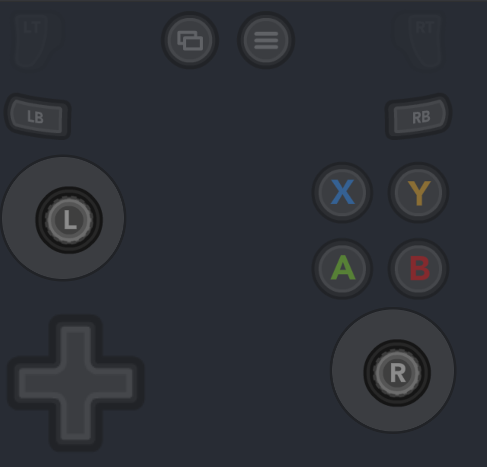

# React Use Gamepad Hook

---

## The `useGamepads` hook

This hook allows a React component to subscribe to the all gamepads and their input.

In this example, we are using an `xbox-utils` helper function to fetch gamepad input for the `A` button.

```typescript jsx
import React, { useState } from 'react';
import { useGamepads } from 'react-gamepads';
import * as xbox from 'xbox-utils'

export const Example: React.FC = () => {
  const [gamepads, setGamepads] = useState({});
  useGamepads(gamepads => setGamepads(gamepads));
  return <div>{xbox.button(gamepads[0], 'A').pressed}</div>;
}
```

## Xbox Utils

Utility functions and types for fetching gamepad input objects using conventional labels.

Getting button input.

```typescript
// GamepadButton
xbox.button(gamepads[0], 'A')

// true if pressed, false otherwise
xbox.button(gamepads[0], 'A').pressed
```

Getting axes values for joysticks.

```typescript
// number from 0..1  ad
xbox.axesVertical(maybeXboxGamePad, 'L-Joy')
```

### Debug Widget (Xbox Only)

For debugging purposes we've provided an on-screen controller widget.
This widget mimics the input on the gamepad on-screen.

```typescript jsx
// Change gamepadInd to index of xbox controller on your local machine
const App: React.FC = () => {
  return (
    <AppContainer>
      <XboxWidget gamepadInd={2}/>
    </AppContainer>
  )
}

export default App
```




